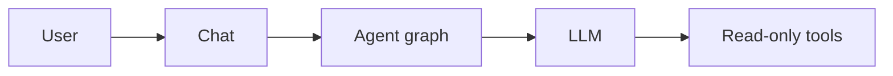

# Режим: ask

## Реализация

- Промпт-дополнение: `Agent/prompts/ask.md` (фолбэк — `_MODE_ADDONS_FALLBACK["ask"]` в `Agent/prompts/__init__.py`).
- `build_tools(ask_mode=True)` фильтрует список: имена из `_ASK_EXCLUDED_TOOL_NAMES` в `Agent/tool_registry.py` удаляются из сессии.
- Политика brain (`Agent/project_brain/policy.py`, `"ask"`): только чтение, `rag_search` форсируется в набор тулов даже при выключенных custom tools (`forced_tool_names`); полный refresh и запись в brain недоступны.

## Схема потока

## Инструменты

**Недоступны** (имена, см. `_ASK_EXCLUDED_TOOL_NAMES`): `edit_file`, `write_file`, `replace_file_lines`, `insert_file_lines`, `code_file_tool`, `docx_write_tool`, `docxedit_tool`, `docx_document_advanced_ops`, `pdf_styled_document_create`, `git_ops`, `download_file`, `run_command`, `start_background_task`, `get_background_result`, `run_package_script`, `create_pdf`, `file_versions_tool`, `code_interpreter`, `project_brain_tool`, `apply_patch`, `export_to_brain`, `qa_extended_tool`, `spawn_subagent`, `get_subagent_result` (суб-агент наследует полный набор родителя — включая `run_command`/`edit_file` — поэтому его тоже нельзя запускать из read-only режима).

**Доступны** (типично): чтение файлов, поиск по репо, `web_search` / `web_fetch`, `library_context`, `rag_search` (форсируется всегда, даже при выключенных custom tools), `ask_user`, `reasoning_tool`, `ocr_tool`, `office_document_read`, и др. из оставшегося списка после фильтра. Для записи выводов в Project Brain — переключиться в Agent или Brainer.
