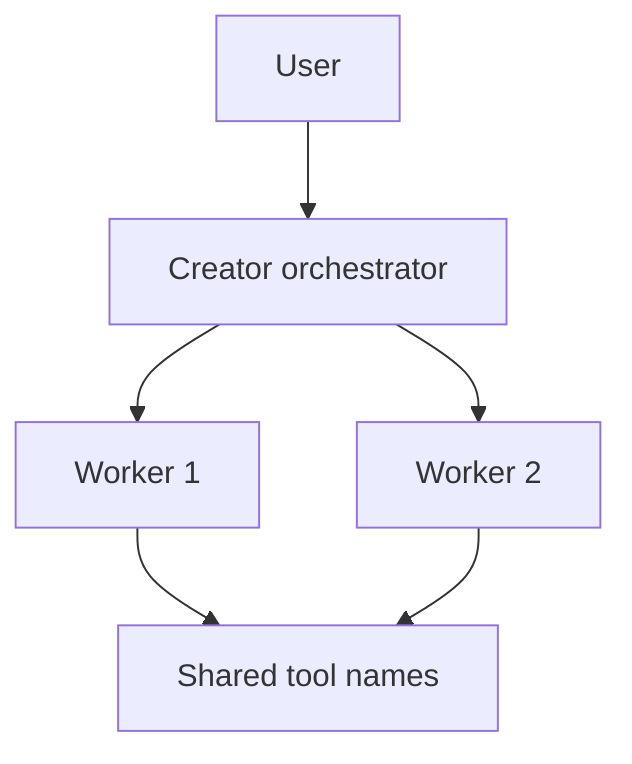

# Режим: creator

## Реализация

- Оркестрация: `Agent/creator_mode.py`, `Agent/creator_orchestration.py`; UI — дерево воркеров в `ActiveAgentsPanel`.
- В TUI `creator` включает `agent_mode=True` для набора тулов (браузер по prefs), см. `_sync_tui_tool_bundle("creator")`.
- Параллельность и стратегия: prefs `orchestration_mode`, `orchestration_max_workers` в `Interface/ui_prefs.py`.

## Схема потока

## Инструменты

Те же имена тулов, что у основного агента в режиме Agent (включая компактные). Воркеры не должны конфликтовать по одним и тем же путям — следует промпту режима в `Agent/prompts/creator.md`. Каждый воркер получает укороченный `WORKER_SYSTEM_PROMPT` (`Agent/system_prompt.py`) вместо полного `SYSTEM_PROMPT` сессии — экономия контекста при параллельном запуске нескольких воркеров.

## Запись в Project Brain

После завершения корневого запуска (`is_root_run`) автоматически пишется сводка прогона в `project_brain/agent/creator_summary.md` (задача, статус воркеров, изменённые файлы, синтез супервайзера). Полный `refresh_project_brain` запускается только если воркеры реально изменили файлы (`Agent/project_brain/policy.py`, `"creator"`, `refresh_on_end="if_code_changed"`) — не после каждого запуска Creator.
