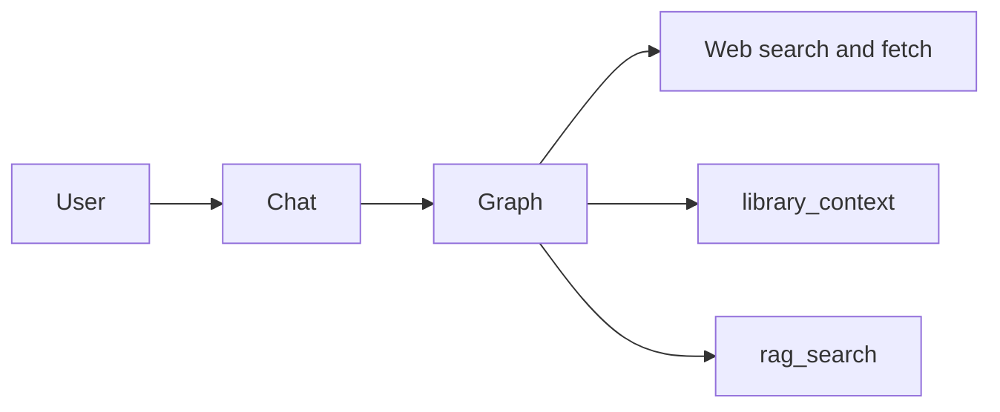

# Режим: research

## Реализация

- Промпт-дополнение: `Agent/prompts/research.md`; в TUI `research` → `agent_mode=True` для расширенного набора (браузер по prefs).
- Доп. параметры: `research_max_sources`, `research_max_rounds`, `research_deep_fetch` в `Interface/ui_prefs.py` / `ui_settings.json`.
- Политика brain (`Agent/project_brain/policy.py`, `"research"`, `export_session_notes="research"`): находки, записанные через `session_notes(tag="research")`, автоматически экспортируются в `project_brain/agent/research_notes.md` при синхронизации brain (`AgentGraph._export_research_notes`) — переживают конец сессии, в отличие от обычных `session_notes`. Дедуплицируется по хэшу записи, повторные синхронизации не плодят копии.

## Схема потока

## Инструменты

Как у Agent (после `_sync_tui_tool_bundle("research")`), с акцентом на веб и документацию в системном фрагменте режима. После каждого раунда с тулами RAG brain переиндексируется с диска (как в Brainer), чтобы ``rag_search`` подхватывал свежие ``project_brain/*.md`` без ожидания конца хода.
